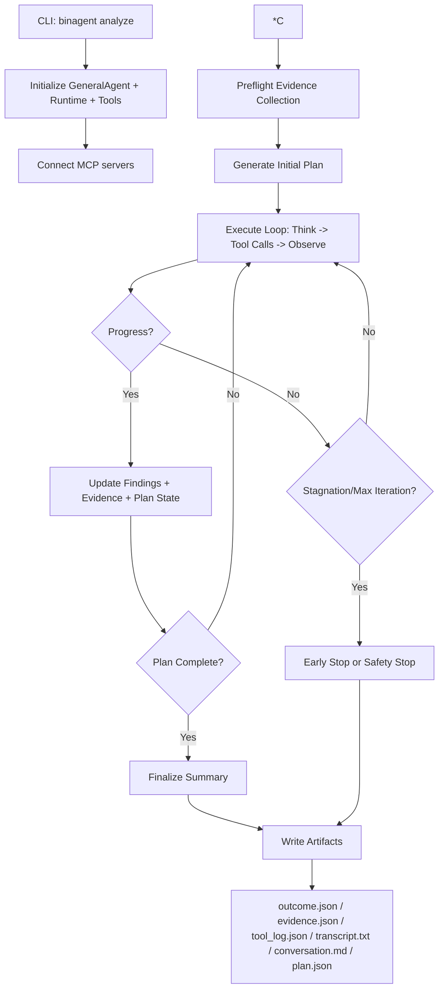
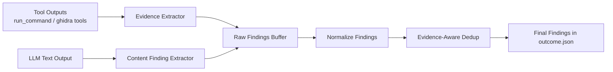
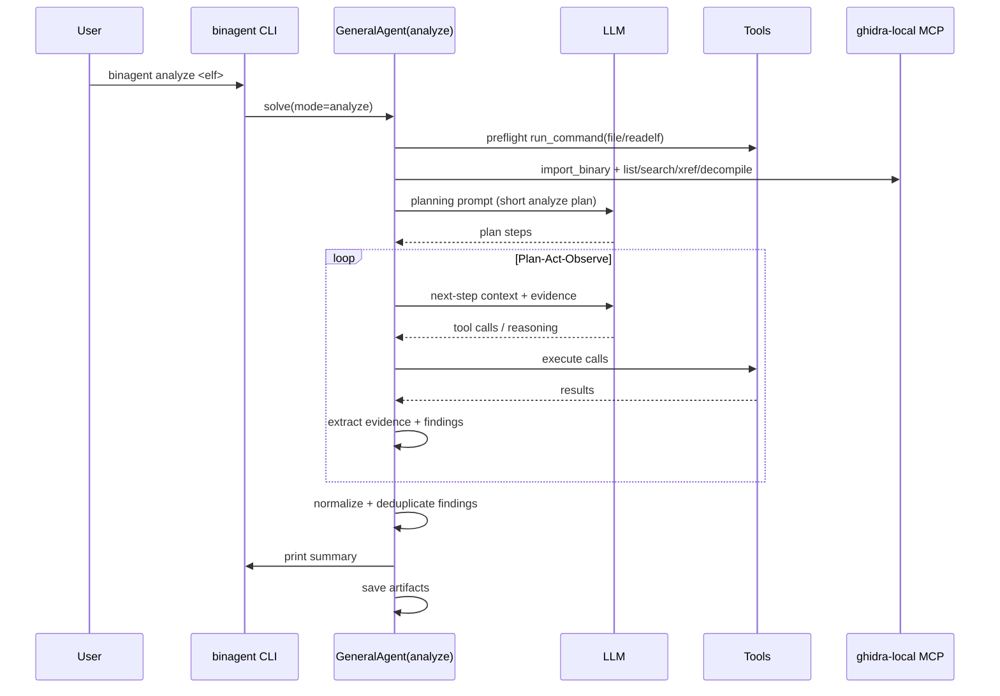

# BinAgent Analyze Mode: Logic and Pipeline

## 1) High-Level Control Logic

## 2) *Analyze Mode Dataflow (Evidence-Centric)

## 3) Sequence View (One Typical Run)

## 4) Key Mechanisms

- Planning first, but now phrased as guidance (not hard-blocking) to reduce tool-use resistance.
- Preflight front-loads static evidence so later LLM steps can focus on triage and mapping to CWE.
- Findings are extracted from:
  - structured tool outputs (especially decompile/xref),
  - model outputs (only non-plan content).
- Dedup is evidence-aware, not exact-string-only:
  - compares CWE + location + evidence similarity,
  - merges duplicates while keeping stronger evidence/confidence.
- Safety guards:
  - protocol sanitization for tool-call message format,
  - LLM API retry/stop behavior,
  - stagnation early-stop to avoid wasting loops.

## 5) Artifact Contract

- `plan.json`: the planned steps for this run.
- `tool_log.json`: all tool calls/results (audit trail).
- `evidence.json`: extracted evidence snippets.
- `outcome.json`: final normalized + deduplicated findings.
- `transcript.txt`: chronological runtime events.
- `conversation.md`: full conversation/tool exchange history.

## 6) One-Line Summary

`binagent analyze` is an evidence-driven control loop: collect static signals, plan actions, execute selectively, convert outputs to CWE findings, deduplicate by evidence similarity, and emit reproducible artifacts.

